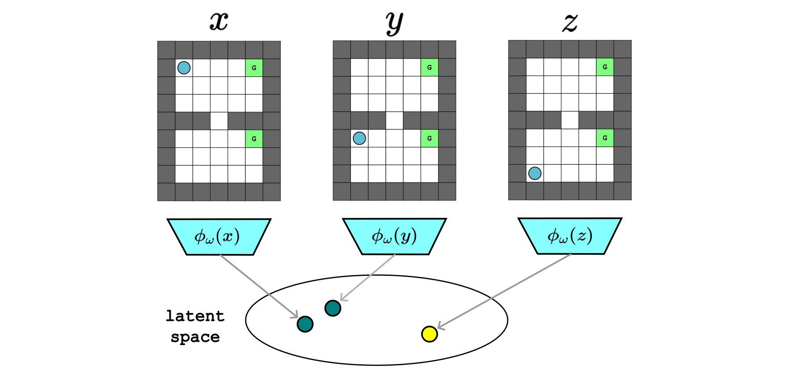

# Bisimulation Prioritized Experience Replay (BPER)

**Thesis Title**: Enhancing Online Reinforcement Learning through Bisimulation Behavioral-Based Priorities

### Overview

This project aims to improve the efficiency of online reinforcement learning by incorporating bisimulation-based metrics into the experience replay process. Bisimulation Prioritized Experience Replay (BPER) prioritizes experiences based on their behavioral differences, identified using bisimulation metrics, to enhance learning by encouraging more diverse and informative sampling.


***MICo Latent Space***. *An illustration of the latent space discovered by MICo Learning, where state representations are grouped based on behavioral similarity. Behaviorally similar states are clustered together (states $x, y$), while dissimilar states are positioned farther apart (states $y, z$).*

### Repository Structure

The algorithms where divided in different folders for easy implementation and changes. 

- **`dqn_gridworld/`**: Contains implementations of various DQN variants for grid-based environments:
  - **Variants Included**: DQN, DQN + MICO, DQN + PER, DQN + MICO + BPERcn, and DQN + MICO + BPERaa.
  - **Customization**: Hyperparameters are configurable through `config_gridworld.yaml`.
  - **Files:**
    - **`dqn.py`**: Main reinforcement learning loop.
    - **`utils_experiments.py`**: Additional functions for conducting and managing experiments.
    - **`utils_grid_world.py`**: Functions related to customizing the grid world environment in TorchRL.
    - **`utils_metric.py`**: Functions to calculate the MICo bisimulation metric, based on [Google Research MICO](https://github.com/google-research/google-research/blob/master/mico/atari/metric_utils.py).
    - **`utils_modules.py`**: Definitions of customized models, such as the DQN with MICO loss and DQN network with representation outputs.

- **`dqn_pixel/`**: Implements DQN and DQN + PER variants for pixel-based environments:
  - **Customization**: Configurable through `config.yaml`.
  - **Files:**
    - **`utils_dqn.py`**: Functions related to customization for pixel-based environments in TorchRL.
    - **`utils_modules.py`**: Definitions of customized models for pixel-based DQN variants.

- **`dqn_pixel_mico/`**: Implements DQN variants using MICO for pixel environments:
  - **Variants Included**: DQN + MICO, DQN + MICO + BPERcn, and DQN + MICO + BPERaa.
    - **Customization**: Configurable through `config.yaml`.
  - **Files:**
    - **`utils_dqn.py`**: Functions related to customization for pixel-based environments in TorchRL.
    - **`utils_modules.py`**: Definitions of customized models.
    - **`utils_metric.py`**: Functions to calculate the MICo bisimulation metric, similar to [Google Research MICO](https://github.com/google-research/google-research/blob/master/mico/atari/metric_utils.py).

- **`motivating_example/`**: Contains notebooks for calculating exact bisimulation, on-policy bisimulation, bisimulation metric, and on-policy bisimulation metric using the Grid World environment.

- **`plot_utils/`**: Contains notebooks for generating and customizing plots of experiment results.

- **`custom_envs/`**: Contains proposed Grid World environments defined in `.txt` files and the `GridWorld` class to set up these environments in Gym.

- **Miscellaneous**:
  - **Sandboxes and notebooks** scattered throughout the repository were used for testing small features but are no longer relevant.


### Installation

To set up the environment and install the required packages, run:

```bash
conda create -y --name final-project python=3.10
conda activate final-project
pip install torchrl torch torchvision torchviz wandb
pip install hydra-core tqdm gymnasium gymnasium[classic-control]
```

**Disclaimer**: there could be incompatible issues due to the nvidia driver versions, we
recommend to set device: cpu in the configuration file for running using the cpu.

### Usage

1. Run Training: Open a folder with `dqn_<something>\` and run the main script `python dqn_<something>.py` to start training.

2. Monitor Training: Track the training progress using `wandb` or any other configured visualization tool. The wandb is disabled by default

### Future Work
- Extension to continuous action spaces.
- Further optimization of the bisimulation metric computation.
- Incorporation of auxiliary mechanisms for more robust performance.

### License
This project is licensed under the MIT License. See the LICENSE file for details.

#### Acknowledgments
This project is part of a thesis submitted to the School of Computer Science, College of Engineering and Physical Sciences, University of Birmingham (2023-24).